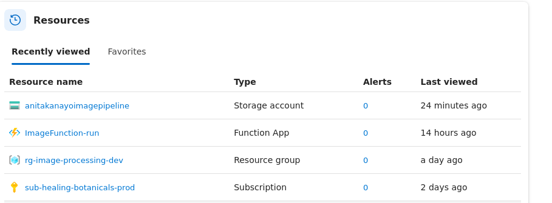
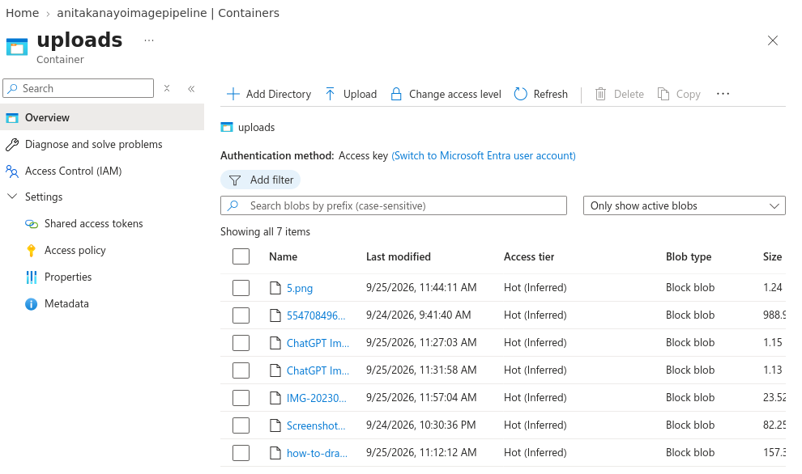
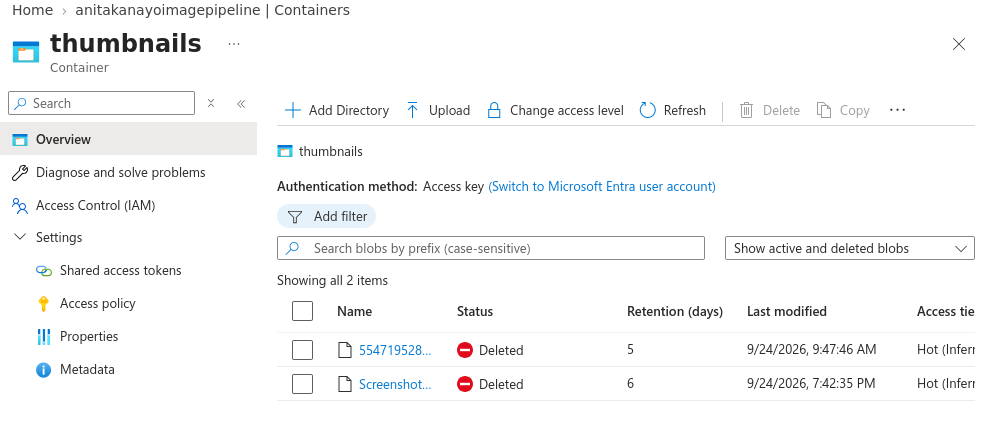
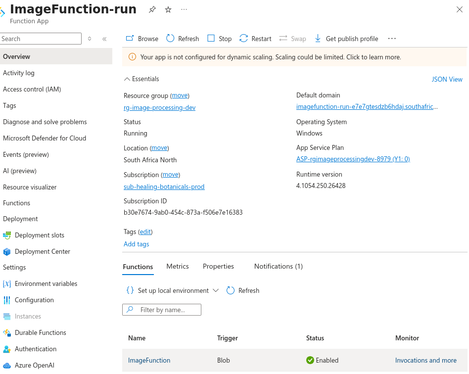
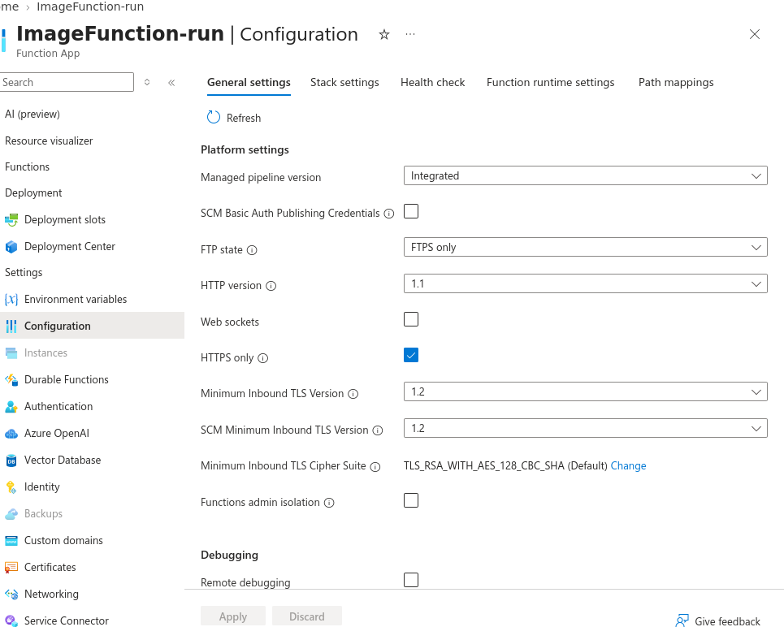
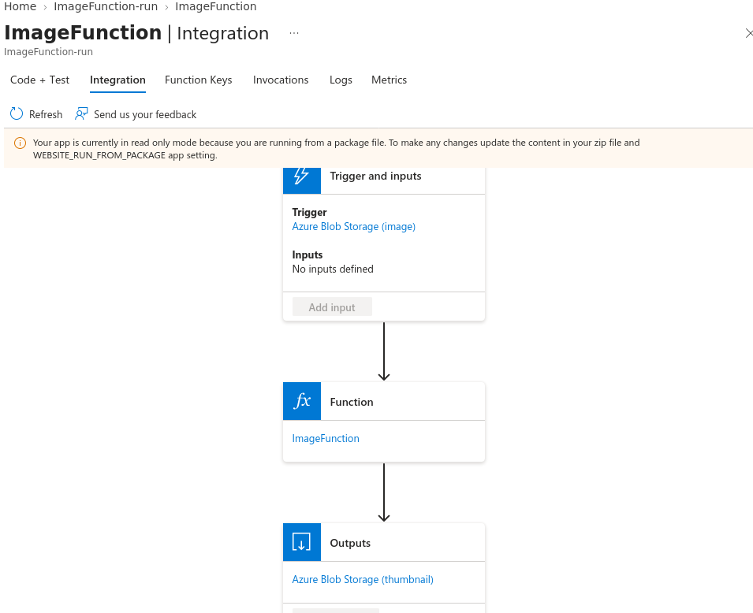

# Project Screenshots

Visual documentation of the **Azure Serverless Image Processing Pipeline**.

---

## Azure Resources and Subscription

## Azure Blob Storage —  Containers

## Azure Blob Storage — Uploads Container

> Upload container containing the original images submitted for processing.

---

## Azure Blob Storage — Thumbnails Container

> Output container where the processed thumbnails are intended to be stored.

---

##  Azure Function Overview

> Azure Function App running the `ImageFunction` serverless image-processing function.

---

## Blob Trigger Integration

> Blob Trigger configured to detect new images uploaded to `uploads/{name}` and send the processed image to `thumbnails/{name}`.

